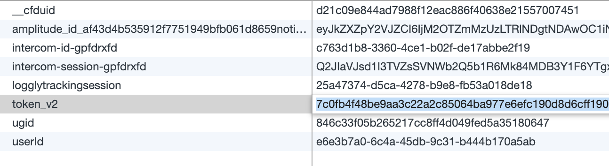
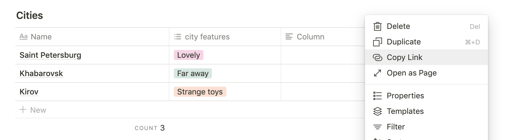
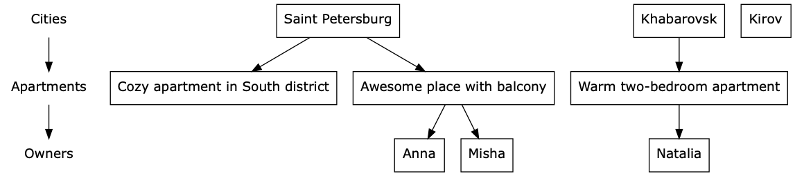

# notion_so_tree
Extract, process and visualize databases from lovely Notion.so to tree graphs.

## Purpose
We use it in [Cindicator.com](https://cindicator.com) for visualization our [OKR](https://en.wikipedia.org/wiki/OKR).
 It is a big tree (really big tree) of company objectives which decomposed from a company level to each person level.  

## Quickstart
Required [poetry](https://github.com/sdispater/poetry#installation) and [graphviz](https://www.graphviz.org/download/).

Run `poetry install`, then run
 
`poetry run python notion_so_tree.py --help`

Let's pretend that you have notion page with few databases and you want build the tree graph.

First of all extract API_KEY from cookies (field 'token_v2')

Then collect databases view urls with respect to order:

Okay, now you have enough data to draw graph. You should retrieve data 
from notion.so API with util command.

`poetry run python notion_so_tree.py retrieve <api_key> <cities_link> <apartments_link> <owners_link>`

Now you have exported_collections file with json data. Let's draw!

`poetry run python notion_so_tree.py draw exported_collections_2019-05-05-12:34:14.json`

What's a lovely draw, isn't?

